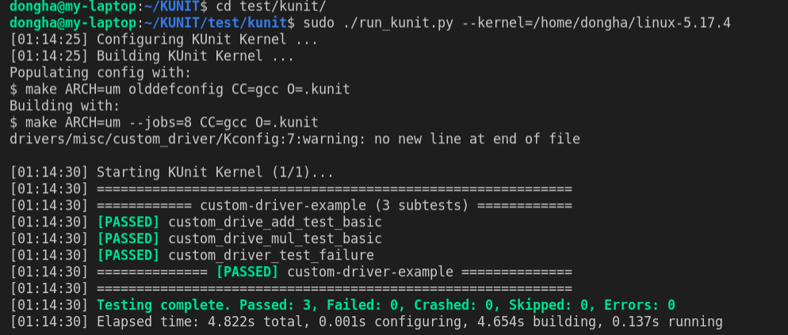

# Kernel_Driver_Testing

how to test driver code using KUnit in UML?

1. Install linux-5.17.4 `wget https://www.kernel.org/pub/linux/kernel/v5.x/linux-5.17.4.tar.gz`
2. Unzip file `tar -zxvf linux-5.17.4.tar.gz`
3. Clone this repository and enter this directory.
4. Enter KUnit Dir `cd test/kunit/`
5. Run script(run_kunit.py) `sudo ./run_kunit.py --kernel=/home/dongha/linux-5.17.4`
   1. kernel is your linux-5.17.4 path(unziped in step2)
6. Check the result

